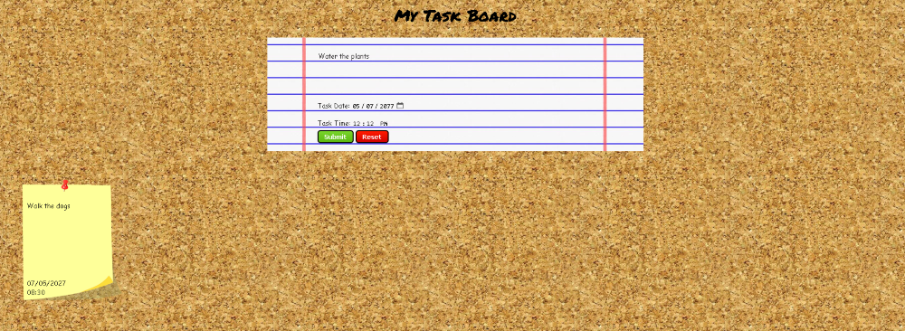
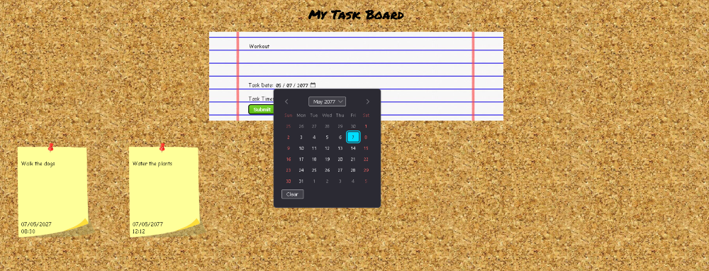
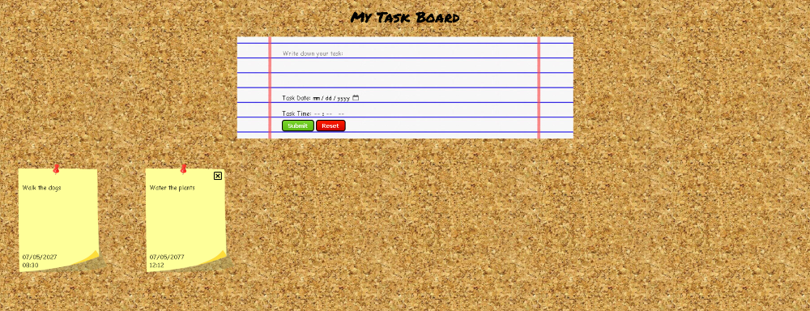

# Task Board

Hello There! Welcome to Task Board, a whimsically simple to-do list.

## Features

- Add Tasks: Users can add new tasks to the task board.

  

- Set Finish Date and Time: Users can set a specific finish date and time for each task.

  

- Remove Tasks: Users can remove tasks once they are completed by clicking the remove button on the task note.

  

## Technologies

- JavaScript
- HTML
- CSS
- Bootstrap

## Installation

To run the project locally, follow these steps:

1.  Clone this repository to your local machine.
2.  Open the index.html file in your web browser.
